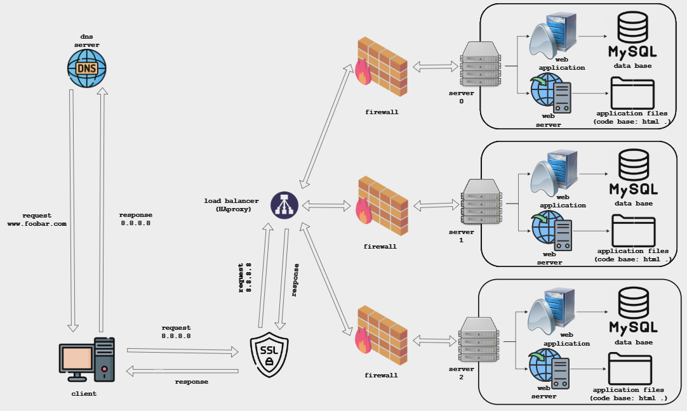

# Postmortem: Web Stack Outage

**Issue Summary:**
Duration: 2 hours (10:00 AM - 12:00 PM, UTC)
Impact: Slow response time and intermittent service disruptions
Affected Service: Website
Percentage of Users Affected: Approximately 30%

**Timeline:**
- 10:00 AM: Issue detected when monitoring system flagged increased response time.
- 10:05 AM: Engineers investigated the web server logs and noticed a high number of database connection errors.
- 10:15 AM: Assumed root cause to be a database issue and escalated the incident to the database team.
- 10:30 AM: Database team investigated the database server and found no abnormalities.
- 10:45 AM: Network team was involved to check for any network-related issues.
- 11:00 AM: Network team identified a misconfigured firewall rule that was causing intermittent connectivity issues.
- 11:30 AM: Firewall rule was corrected, and connectivity was restored.
- 12:00 PM: Service fully recovered, and response time returned to normal.

**Root Cause and Resolution:**
The root cause of the outage was a misconfigured firewall rule that was blocking incoming traffic to the web server. This resulted in intermittent connectivity issues and slow response times. The issue was fixed by correcting the firewall rule, allowing the traffic to flow properly.

**Corrective and Preventative Measures:**
To prevent similar issues in the future, the following measures will be implemented:
- Regular review of firewall rules to ensure they are correctly configured.
- Improved monitoring system to provide real-time alerts for abnormal network behavior.
- Enhanced communication and collaboration between teams to expedite incident resolution.

**Tasks to Address the Issue:**
- Review and update firewall rules to align with security best practices.
- Implement automated network monitoring tools to detect and alert on network anomalies.
- Conduct regular training sessions to enhance cross-team communication and incident response.
